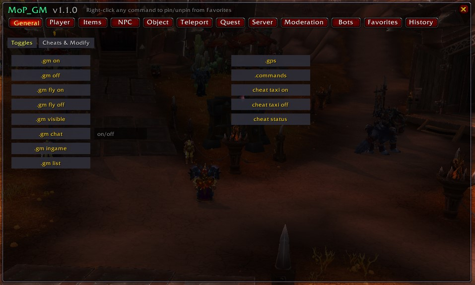
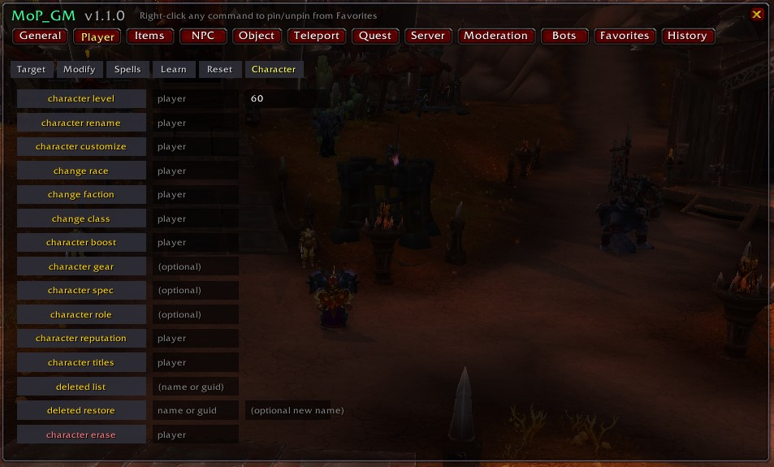
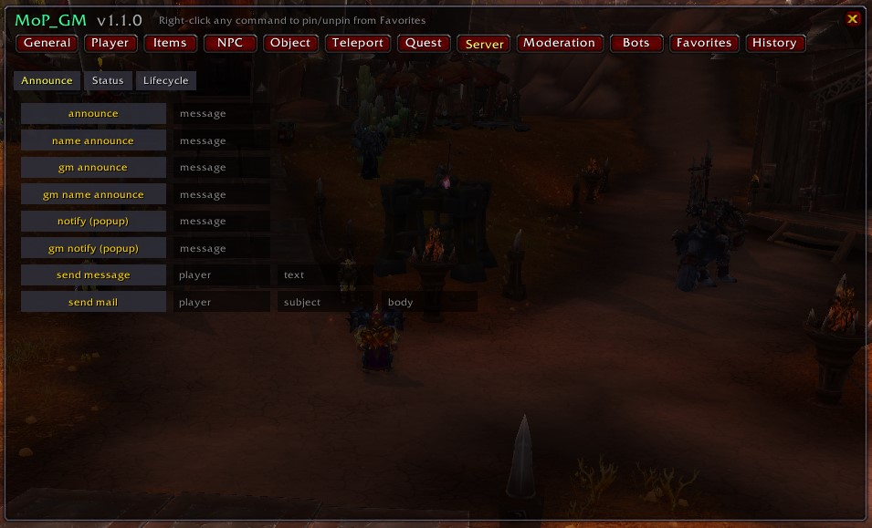

# MoP_GM

[](https://github.com/timoinglin/MoP_GM/releases/latest)
[](https://github.com/timoinglin/MoP_GM/releases)
[](LICENSE)
[](https://www.emucoach.com/)

A clean, movable GM panel for **World of Warcraft Mists of Pandaria 5.4.8** private servers — built and tested against [Emucoach](https://www.emucoach.com/) repacks (TrinityCore-based).

Every common GM command is one click away, with input fields right next to each command. Every command has been **cross-checked against the server's `world.command` table** so the addon only exposes what actually works on your server.

### ⬇ [Download the latest release](https://github.com/timoinglin/MoP_GM/releases/latest/download/MoP_GM.zip)

---

## Screenshots


*General tab — **Toggles** and **Cheats & Modify** sub-tabs, 2-column layout.*


*Player tab — six sub-tabs: Target, Modify, Spells, Learn, Reset, Character.*


*Server tab — Announce / Status / Lifecycle sub-tabs.*

---

## Install

1. **Download** the zip: [MoP_GM.zip](https://github.com/timoinglin/MoP_GM/releases/latest/download/MoP_GM.zip)
2. **Extract** the `MoP_GM` folder into your client's AddOns directory:
   ```
   World of Warcraft\Interface\AddOns\MoP_GM\
   ```
   The folder must contain `MoP_GM.toc` directly — i.e. the path `…\Interface\AddOns\MoP_GM\MoP_GM.toc` should exist.
3. **Launch** the game. On the character-select screen, open **AddOns** and confirm `MoP_GM` is listed and enabled.
4. **Log in.** A small gear icon appears next to your minimap — click it to open the panel, or type `/gm` in chat.

> ℹ Your account needs the GM level required for the commands you intend to run. The addon doesn't elevate permissions — it just sends the chat lines on your behalf.

---

## How to use

| Action | Result |
|---|---|
| **Click** a command label | Runs the command using the values in the input fields |
| **Press Enter** in any input field | Runs the command for that row |
| **Right-click** any command label | Pin / unpin it from the **Favorites** tab |
| **SHIFT-drag** the minimap button | Move the launcher button anywhere on screen |
| **Drag the panel header** | Move the main panel |
| **Click the X** on the panel header | Close the panel |
| `/gm` *or* `/mopgm` | Toggle the panel |
| `/mopgm reset` | Recenter panel and minimap button |
| `/mopgm debug` | Print module load status (for troubleshooting) |
| `/mopgm probe <command>` | Send a chat command and capture its server response inline |

Destructive commands (ban, kick, server shutdown, reset, delete, …) show a confirmation popup before sending.

---

## Tabs

| Tab | Sub-tabs | What's inside |
|---|---|---|
| **General** | Toggles • Cheats & Modify | `.gm on/off/fly/visible/chat/list/ingame`, `.gps`, `.cheat god/power/cooldown/casttime/waterwalk/explore/taxi/status`, `.morph`, `.mount`, `.modify scale`, `.modify speed all/walk/backwalk/swim/fly` |
| **Player** | Target • Modify • Spells • Learn • Reset • Character | All player operations: appear/summon/kick/freeze/revive, modify hp/mana/rage/energy/honor/runicpower/phase/gender/drunk/standstate/faction/reputation/currency, the full `.cast` and `.learn` families, reset talents/spells/stats/level/achievements/honor/pvpstat, `.character level/rename/customize/changerace/changefaction/changeclass/boost/gear/spec/role/reputation/titles/deleted list/deleted restore/erase` |
| **Items** | flat | `.additem`, `.additemset`, `.removeitem`, `.repairitems`, `.deleteditem list/restore`, `.itemdelete`, `.send items`, `.send money`, `.list item`, `.lookup item/itemset`, `.bank` |
| **NPC** | Spawn • Modify | spawn / delete / move / follow / chat (say/yell/whisper/playemote), full `.npc set` family (level / factionid / entry / flag / model / movetype / phase / spawndist / spawntime), `.lookup creature/event/faction`, `.distance`, `.guid` |
| **Object** | flat | `.gobject add`, `.gobject add temp`, delete / move / turn / near / target / info / activate, `.gobject set phase`, `.lookup object` |
| **Teleport** | Tele • Go • Locations | `.tele <name>`, `.tele group`, `.tele name`, `appear` / `summon`, plus the full `.go` family (xyz/zonexy/creature/object/graveyard/grid/taxinode/ticket/trigger), `lookup tele/area/map/taxinode`, and a clickable grid of every major MoP location |
| **Quest** | flat | `.quest add`, `.quest complete`, `.quest remove`, `.quest reward`, `.lookup quest` |
| **Server** | Announce • Status • Lifecycle | All announce variants (`announce / nameannounce / gmannounce / gmnameannounce / notify / gmnotify`), `send mail / message`, `.server info / motd / set motd / set closed / set loglevel / plimit / corpses / stats mapupdate / saveall / reload`, full shutdown/restart family with cancels (`.server shutdown / restart / idleshutdown / idlerestart` + each `cancel`), `.server exit` |
| **Moderation** | Bans • Mute / Inspect | `.ban account/character/playeraccount/ip` + each `.unban` + each `.baninfo` + each `.banlist`, `.mute / .unmute` + `.mutelist account/character`, `.kick`, `.freeze / .unfreeze / .listfreeze`, `.pinfo`, `.lookup player account/ip/email`, `.whispers` |
| **Bots** | flat | Emucoach reworked PlayerBot system: `.bot add` (gossip), `.bot addRoleBotsToGroup`, `.bot manageselectedbot`, `.bot manageparty` |
| **Favorites** | dynamic | Your pinned commands, persisted across sessions |
| **History** | dynamic | Last 20 commands you sent — click any to re-run |

Tabs with many commands are split into **sub-tabs** so nothing scrolls and the UI stays snappy.

---

## Compatibility

- WoW client **5.4.8** (interface 50400). It will not load on other clients without changing the TOC.
- Designed for **TrinityCore-based** servers (Emucoach, TwinStar, etc.). Every command is sent as a regular chat message; the server intercepts dot-commands before broadcasting.
- No external libraries — uses only the built-in WoW UI APIs available in 5.4.8.

---

## Troubleshooting

- **Something looks wrong** — run `/mopgm debug`. It prints whether each module loaded and whether the main frame and toggle button were created. If any module shows `MISSING`, that file failed to load — copy the output and [open an issue](https://github.com/timoinglin/MoP_GM/issues).
- **Toggle button is off-screen / behind the minimap** — run `/mopgm reset` to recenter both the panel and the launcher button.
- **A button doesn't work on your server** — run `/mopgm probe <command>` (e.g. `/mopgm probe .additem 6948 1`) to capture the server's response inline. If your server returns "no such command" or "no such subcommand", that command isn't installed on your repack — open an issue with the probe output and we'll adjust the addon.

---

## License

[MIT](LICENSE) — do whatever you want with it.

---

## Credits

- [Emucoach](https://www.emucoach.com/) for the MoP 5.4.8 repacks and the reworked PlayerBot system.
- TrinityCore for the canonical `.command` set.
